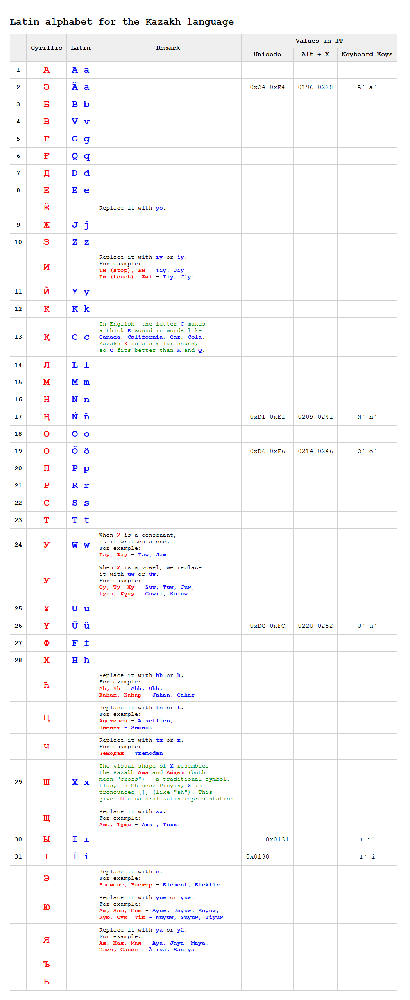

# CazacLetter — A Latin Alphabet for the Kazakh Language

> A systematic, aesthetic Latin alphabet for Kazakh — designed for grammar, 
> readability, and IT compatibility.

 

## Overview

Kazakhstan currently uses the Cyrillic alphabet, which does not fully match 
Kazakh phonology. Official Latin alphabet proposals have been criticized for 
being aesthetically poor and overly influenced by Russian transcription 
habits.

**CazacLetter** is a proposal for a Latin alphabet that:

- ✅ Matches Kazakh phonology more accurately
- ✅ Uses Latin letters consistent with English, German, and Pinyin conventions
- ✅ Includes Unicode values, keyboard shortcuts, and layout details
- ✅ Is designed for IT — clean Unicode, easy typing, no diacritics where possible

 

## The Alphabet

 

## Design Rationale

### Why `Қ → C`?

In English, the letter C makes a thick K sound in words like
*Canada*, *California*, *Car*, *Cola*.
Kazakh Қ is a similar sound, so C fits better than K and Q.

### Why `Ш → X`?

The visual shape of X resembles the Kazakh *Аша* and
*Айқыш* (both mean "cross") — a traditional symbol.
Plus, in Chinese Pinyin, X is pronounced [ʃ] (like "sh").
This gives Ш a natural Latin representation.

### Why `У → W` (consonant) vs `uw`/`üw` (vowel)?

In Cyrillic, У can function as either a consonant or a vowel:
- **Consonant:** *Taw, Jaw* → written with W
- **Vowel:** *Suw, Juw, Tuw* → written with uw/üw

This distinguishes the two functions visually.

<!-- [Add more rationale sections] -->

 

## IT Implementation

| Feature | Detail |
|---------|--------|
| **Unicode** | Every character has a valid Unicode codepoint |
| **Alt+X** | Shortcut sequences for Windows |
| **Implementation** | System-tray utility (CazacLetter.exe) — intercepts keystrokes via a hook and substitutes characters |
| **Fallback** | No combining characters — all precomposed |
| **Keyboard layout** | ✅ Not required — CazacLetter runs independently of the active keyboard layout |

 

## Comparison with Official Proposal

| Feature | Official Proposal | CazacLetter |
|---------|-------------------|-------------|
| **Aesthetic** | Criticized as unattractive | Designed for visual clarity |
| **Grammar fit** | Incomplete | Systematic |
| **IT readiness** | Mixed | Full Unicode support |
| **Key mapping** | Underspecified | Fully specified |

 

## Files

- `alphabet-en.html` — Interactive alphabet table (English)
- `alphabet-kz.html` — Kazakh version
- `CazacLetter.exe` — system-tray utility (Win32 and x64)
- `screenshots/` — Visual previews
<!-- - `CazacLetter/` — source code (if you want to include it) -->

 

## Status

**Proposal stage.** Not officially adopted. Provided as an open contribution 
to the discussion on Kazakh alphabet reform.

 

## License

**CC0 1.0 Universal (Public Domain)**

This work is dedicated to the public domain. Anyone may use, modify, or 
distribute it for any purpose, without attribution.

The goal is simple: give Kazakh speakers a better alphabet. No money, 
no recognition needed.

 

## Contact

**Tolkyn Akhmetollauly**

- GitHub: [@tolkensak](https://github.com/tolkensak)

 

---

*"I just want people to have a normal alphabet."*